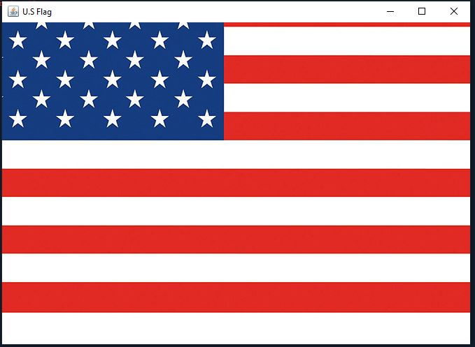

# Raise Flags

Rewrite Listing 15.13 using a thread to animate a flag being raised. Basically just rewriting the code 
of 15.13 to fit with a threading design.

## Example Output



## Analysis Steps

Well, I figured out the requirements of this program, by simply looking in the book or what I had to do which was
 look inside the pearson in the supplemental material section to find the 30.3 assignment
then reading the text that says I need to go back and rewrite an old set of code that i've previously seen
in chapter 15 in 15.13 Animate flag. Now it says I have basically rewrite the code in 15.13 using the new 
knowledge that i've learned in chapter 30 of threading.

### Design

I used different a few classes and one method for this program, I used classes to define and initialize the threads 
and I used the method in order to display the flag that moves across the interface screen.

```
 public Flag() {
  FlagPanel flagPanel = new FlagPanel();
  add(flagPanel);
  Thread thread = new Thread(flagPanel);       // Create Thread
  thread.start();
 }
 
 class FlagPanel extends JPanel implements Runnable {
  private int currentFlag = 0;
  private ImageIcon imageIcon;
  private int x;
  private int y;
  private static final long serialVersionUID = 1L;
  private boolean newFlag = true;
  private Image image;
```

### Testing


Step 1: Create Thread

```
 FlagPanel flagPanel = new FlagPanel();
  add(flagPanel);
  Thread thread = new Thread(flagPanel);       // Create Thread
  thread.start();
 }
```

Step 2: Set Screen

```
public static void main(String[] args) {       // Set Screen
  JFrame frame = new JFrame();               
  frame.add(new Flag());
  frame.setTitle("U.S Flag");                     
  frame.setDefaultCloseOperation(JFrame.EXIT_ON_CLOSE);
  frame.setSize(500, 500);
  frame.setMinimumSize(new Dimension(frame.getWidth(), frame.getHeight()));
  frame.setLocationRelativeTo(null);
  frame.setVisible(true);
 }
```
Step 3: Task Class
```
class FlagPanel extends JPanel implements Runnable {          //Task Class
  private int currentFlag = 0;
  private ImageIcon imageIcon;
  private int x;
  private int y;
  private static final long serialVersionUID = 1L;
  private boolean newFlag = true;
  private Image image;
```
Step 4: Implement Image Method to display flag

```
@Override
  protected void paintComponent(Graphics g) {          //Implement Image
   super.paintComponent(g);
   if (newFlag) {
    y = getHeight();
    newFlag = false;
     imageIcon = new ImageIcon(this.getClass().getResource("flag" + ".gif"));
    image = imageIcon.getImage();
   }
   x = (getWidth() - imageIcon.getIconWidth()) / 2;
   g.drawImage(image, x,  y, imageIcon.getIconWidth(), imageIcon.getIconHeight(), this);
   if (y + imageIcon.getIconHeight() <= 0) {
    newFlag = true;
    currentFlag++;
    if (currentFlag > 6) {
     currentFlag = 0;
    }    
   }
  }
```
Step 5: Run the thread
```
public void run() {         //Run
   try {
    while (true) {
     Thread.sleep(10);
     y--;          
     repaint();
    }
   } catch (InterruptedException e) {
    e.printStackTrace();
   }
  }
 }
}
```

You can use the data to compare with 15.13 which the assignment states that you should. And from what i've seen
threading seems to look smoother but it moved at about the same speed from what I saw.

## Notes

You can test the 15.13 and thew new rewritten code by setting the delay timer to 10 seconds
and compare.


## Do not change content below this line
## Adapted from a README Built With

* [Dropwizard](http://www.dropwizard.io/1.0.2/docs/) - The web framework used
* [Maven](https://maven.apache.org/) - Dependency Management
* [ROME](https://rometools.github.io/rome/) - Used to generate RSS Feeds

## Contributing

Please read [CONTRIBUTING.md](https://gist.github.com/PurpleBooth/b24679402957c63ec426) for details on our code of conduct, and the process for submitting pull requests to us.

## Versioning

We use [SemVer](http://semver.org/) for versioning. For the versions available, see the [tags on this repository](https://github.com/your/project/tags). 

## Authors

* **Billie Thompson** - *Initial work* - [PurpleBooth](https://github.com/PurpleBooth)

See also the list of [contributors](https://github.com/your/project/contributors) who participated in this project.

## License

This project is licensed under the MIT License - see the [LICENSE.md](LICENSE.md) file for details

## Acknowledgments

* Hat tip to anyone who's code was used
* Inspiration
* etc
