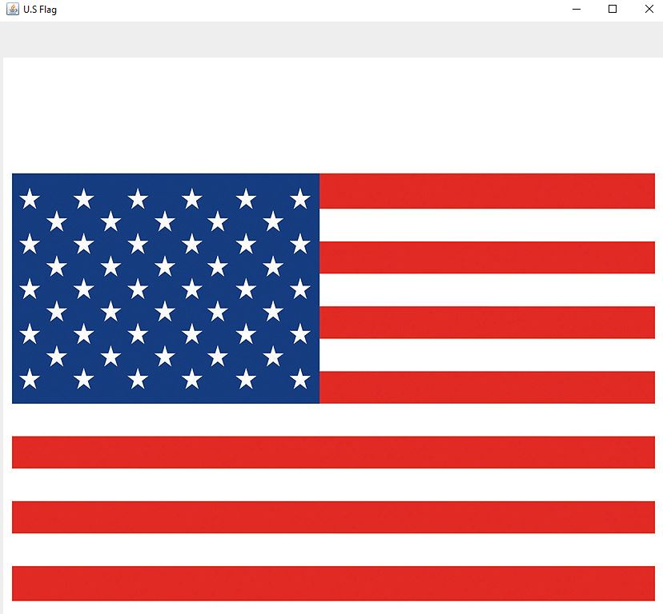

# Raise Flags

Rewrite Listing 15.13 using a thread to animate a flag being raised. Basically just rewriting the code 
of 15.13 to fit with a threading design.

## Example Output



## Analysis Steps

Well, I figured out the requirements of this program, by simply looking in the book or what I had to do which was
 look inside the pearson in the supplemental material section to find the 30.3 assignment
then reading the text that says I need to go back and rewrite an old set of code that i've previously seen
in chapter 15 in 15.13 Animate flag. Now it says I have basically rewrite the code in 15.13 using the new 
knowledge that i've learned in chapter 30 of threading.

### Design

How did you approach your program design? Did you use multiple classes to define various objects?

```
Give examples
```

### Testing

A step by step series of examples that you developed to properly test the program. 

Say what the step will be

```
Give the example
```

And repeat

```
until finished
```

End with an example of getting some data out of the system or using it for a little demo

## Notes

You can test the 15.13 and thew new rewritten code by setting the delay timer to 10 seconds
and compare.


## Do not change content below this line
## Adapted from a README Built With

* [Dropwizard](http://www.dropwizard.io/1.0.2/docs/) - The web framework used
* [Maven](https://maven.apache.org/) - Dependency Management
* [ROME](https://rometools.github.io/rome/) - Used to generate RSS Feeds

## Contributing

Please read [CONTRIBUTING.md](https://gist.github.com/PurpleBooth/b24679402957c63ec426) for details on our code of conduct, and the process for submitting pull requests to us.

## Versioning

We use [SemVer](http://semver.org/) for versioning. For the versions available, see the [tags on this repository](https://github.com/your/project/tags). 

## Authors

* **Billie Thompson** - *Initial work* - [PurpleBooth](https://github.com/PurpleBooth)

See also the list of [contributors](https://github.com/your/project/contributors) who participated in this project.

## License

This project is licensed under the MIT License - see the [LICENSE.md](LICENSE.md) file for details

## Acknowledgments

* Hat tip to anyone who's code was used
* Inspiration
* etc
